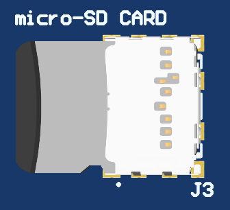
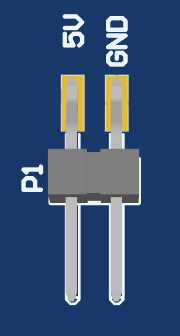
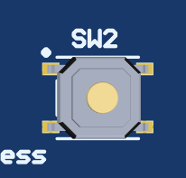
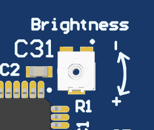
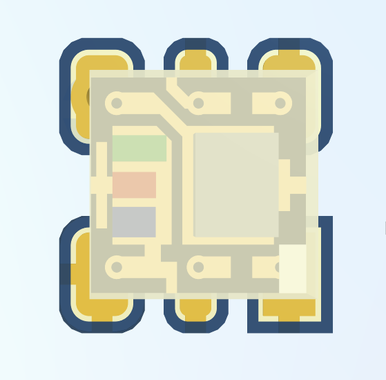

\<Major.Minor\>

## v0.1
- First version, builds on Mikrolysreklamen 17 v0.2

# Mikrolysreklamen15

Mikrolysreklamen is a 1:60 scale version of the large illuminated advertising sign of the name of UKA. The LEDs used are 2x2mm fully addressable APA102 RGB LEDs, they are not fully to scale as the real sign has 50mm diameter bulbs, which in 1:60 would be 0.8mm diameter.

## Design process

The letters of the sign is converted from whatever design format was used for the big sign to svg, which is then scaled correctly if the original design files was not scaled. The scale is set with 1px = 1mm, meaning the measurements in the file will be correct in pixels, but the measurement in mm will not be correct. This is because the next step is to export as dxf type R14. Then the svg is scaled to 1:60 and exported as dxf. R14 format retains layer information and has larger curve resolution than R12, but does not handle scale in mm well, the base unit in R14 is px.

This correctly scaled dxf is imported into altium designer where it will appear as lines on the selected layer(s). These lines can be selected and converted to a polygon pour per letter, and the negative spaces can be converted to polygon pour cutouts (should be made before the polygon). The letters are added to the top silk layer since this will give a white backround in the letters same as on the large sign.

The footprint for the LEDs contain a top silk polygon pour cutout to avoid silk screen on the pads of the LEDs. The solder mask expansion, and solder mask expansion to silk screen clearance is built in to the LED footprint. (0.05mm solder mask expansion, 0.1mm solder mask to silk screen clearance)

The design on the backround (if present), can be imported to the top solder layer as a polygon pour (not cutout) if the color of any copper surface finish is suitable for this design. i.e. ENIG for Lurifax and Ta-De-Du!

## Control circuit

The LEDs are controlled by an AtXmega (U1), chosen since at the time the design of Mikrolysreklamen was started multiple members of Lysreklamen were working at Atmel and the microcontroller was easily available for free. As well as having enough processing power (but not memory) to display the animations.

The microcontroller is supplied from a 3V3 regulator (U3).

Since the LEDs require 5V there is a level shifter (U2) on the SPI lines from the AtXmega to the LEDs.

The animations are stored on a micro-SD card (J3) in .pgm format which is the same format that the large sign uses. The files for the large sign can be used directly on Mikrolysreklamen, see the FW repo for more details.

There is two pads meant for power connection to Mikrolysreklamen (J1), here a angled 2.54mm pitch SMD header can be used, or wires can be soldered directly to the PCB. (or other creative connections can be attached with solder and or glue)
There is no reverse polarity or overvoltage protection. Mikrolysreklamen runs on 5V.

The power switch (SW1) can be used to turn on and off Mikrolysreklamen

The pushbutton (SW2) is connected to GPIO PD3 and can be used by the FW.

The trim potmeter (R1) is connected to PA5 (ADC5) and provides an analog signal between GND and 3.3V. This can be used to set the brigthness of the LEDs. (via FW)

## Assembly

The BOM and assembly drawings can be found in the pdf in the project outputs folder in this repo.

First solder all the LEDs, then flip the board, and place the board on a sacrificial PCB or similar plate on the subsequent run through the soldering oven.

### LEDs

The LEDs are fairly small, and are best mounted using a stencil and soldering oven.

The square pad indicates pin 1 (SDO) And shall line up with the white square in the (topside/light emmiting side) corner of the LED (actually pin 3 in the footprint since the footprint was created before the LEDs was ordered and the documentation of the LEDs at the time was poor and no datasheet existed).

Note: not all LEDs have the same orientation, the orientation is chosen to make routing possible, and sometimes to align with the angle of the section of the letter.

### Backside components

The backside components are larger and more straigthforward, but still reccomended to use stencil and soldering oven since the stencil exists, and you already have the soldering oven assembly flow set up.

Do not mount J1, this is only used for programming, mikrolysreklamen can be programmed by pressing the connector against the pads manually. Mount J1 only if you are going to do FW development as it interferes with wearing Mikrolysreklamen.

When mounting SW1 you will need to clip or cut off the plastic pin on the underside, as this is meant to locate the switch during assembly and provide mechanical stability, but we do not want any holes in our PCB. The same is true for P1 if you chose to use a SMD RA 2.54mm pitch pin header.

M1 (and possibly M2, and M3) can be mounted to attach the Mikrolysreklamen to fabric temporarily. If a more permanent attachement is desired hoops of copper wire can be made and soldered to the pads, and then Mikrolysreklamen can be sewn to fabric using the hoops. There is also pads in the corners of the PCB where hoops for sewing also can be attached.

